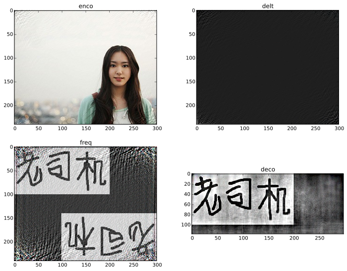
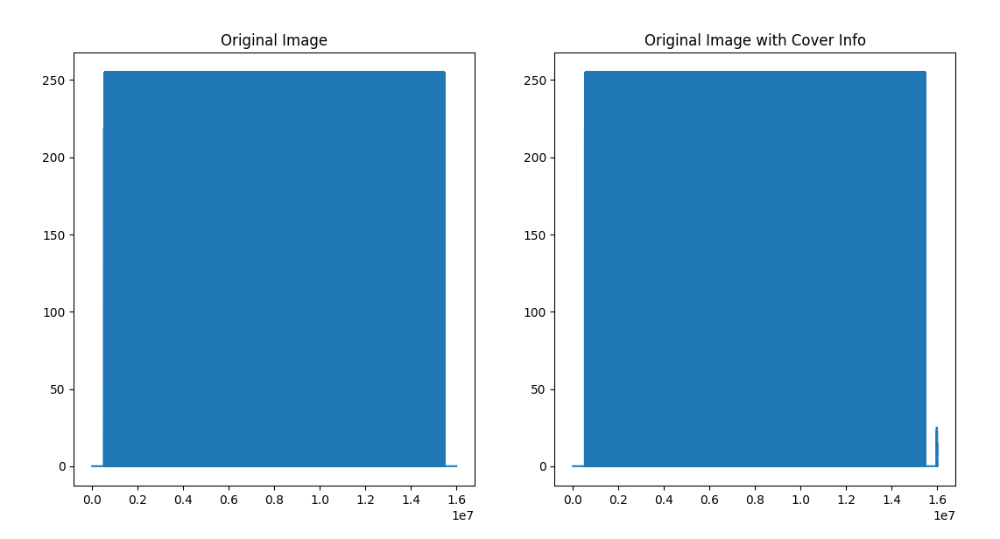

FdSig
===

Very simple frequency domain(FFT based) image steganography/waterprint/signature.

Reference: [https://www.zhihu.com/question/50735753/answer/122593277]()

Support index shuffle with secret in image mode and text mode:

Usage
---

usage: FdSig.py [-h] [-o OUTPUT] [-s SECRET] [-i IMAGESIGN] [-t TEXTSIGN]
                [-a ALPHA] [-d DECODE] [-v]
                file

positional arguments:
  file                  Original image filename.

optional arguments:
  -h, --help            show this help message and exit
  -o OUTPUT, --output OUTPUT
                        Output filename.
  -s SECRET, --secret SECRET
                        Secret to generate index mapping.
  -i IMAGESIGN, --image IMAGESIGN
                        Signature image filename.
  -t TEXTSIGN, --text TEXTSIGN
                        Signature text.
  -a ALPHA, --alpha ALPHA
                        Signature blending weight.
  -d DECODE, --decode DECODE
                        Image filename to be decoded.
  -v                    Display image.

Audio-Analysis
===
Adds signal into some image pixels. In this version the pattern i visually inspected.

Application example

Examples
=====
> Code image with audio

`python Audio-Analysis.py 'images/gilete1.tif' -o 'gilete1-audios.jpg'`

> Decodes image with audio (visual verification)

`python Audio-Analysis.py 'images/gilete1.tif' -d 'gilete1-audios.jpg'`

Somes usage Examples
=====

To codificate set of local images, as example, run:

`python FdSig.py 'coca.jpg' -o 'pepsi_coca.jpg' -i 'pepsi.png' -v`

To decodificate a codificate local images, as example, run:

`python FdSig.py 'coca.jpg' -d 'pepsi_coca.jpg'`

To perform decodification from decoded image foto, run:

`python FdSig.py 'coca.jpg' -d 'pepsi_coca_foto.png'`
